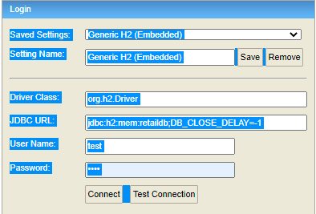
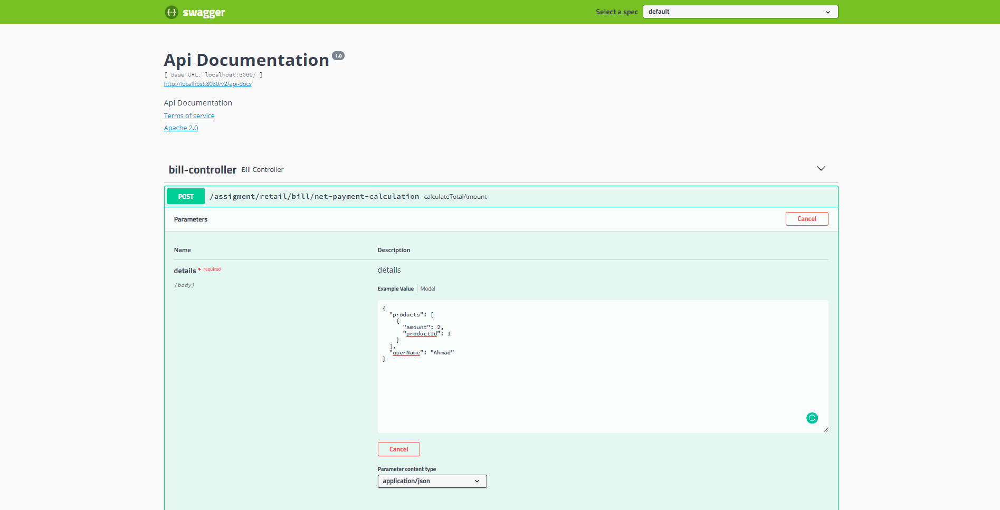
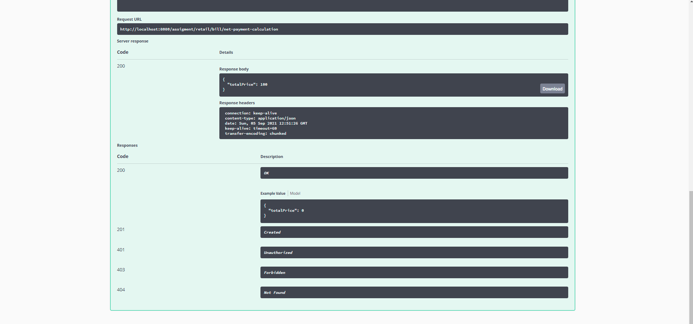

## Retail Discount Application

##### **Requirements**

* For building and running the application you need:

    * [Java8]
    * [Maven]
    * [Lombok]

##### **Running the application locally**

* There are several ways to run a Spring Boot application on your local machine. One way is to execute the main method in the **`com.assignment.retail.RetailApplication class`** from your IDE.
Alternatively you can use the Spring Boot Maven plugin like so:

##### **`mvn spring-boot:run`**

**Running the application test locally**

* you can use Maven command like so:
  
**`mvn clean test`**

##### **Generate Coverage Report**

* We are using `Joccoco` plugin to generate coverage report you need to run the test command above 
  then run the following command :

**`mvn jacoco:report`**

* The generated reports will be in **the project path** under **`/target/site/jacoco`**

##### **UML Diagram**
* [UML-Diagram-Link]
* [UML-Diagram-Link-PDF]

##### **H2 DB**
* After Running the application successfully, you can add data to H2 DB I'm using by opening [H2-Link]
  and filling the following information:
    * username -> test
    * password -> test
    
      

##### **Calling API**
 * The generated api document [API-DOC]
 * To call the api there are several ways such as Swagger, Postman & Curl
   
    * Curl Example
      * Request : `curl -X POST "http://localhost:8080/assigment/retail/bill/net-payment-calculation" -H "accept: */*" -H "Content-Type: application/json" -d "{ \"products\": [ { \"amount\": 2, \"productId\": 1 } ], \"userName\": \"Ahmad\"}"`
      * Response : ` {"totalPrice": 100 } `
    
    * Swagger Example
      * Swagger link locally: http://localhost:8080/swagger-ui.html
      * Request: 
        
        
        
      * Response:   
        
        
        

[Java8]: https://www.oracle.com/java/technologies/javase/javase-jdk8-downloads.html
[Maven]: https://maven.apache.org/
[Lombok]: https://projectlombok.org/
[API-DOC]: doc/api-docs.json
[Swagger-link]: http://localhost:8080/swagger-ui.html
[UML-Diagram-Link]: doc/retail.uml
[UML-Diagram-Link-PDF]: doc/retial.pdf
[H2-Link]: http://localhost:8080/h2-console